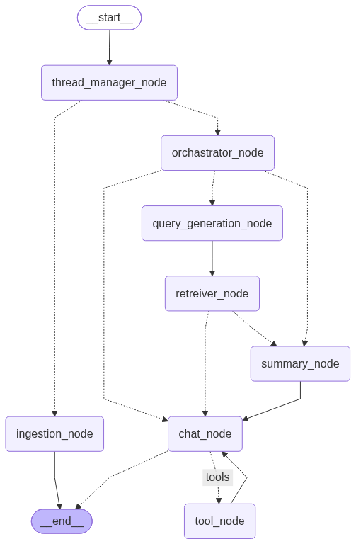
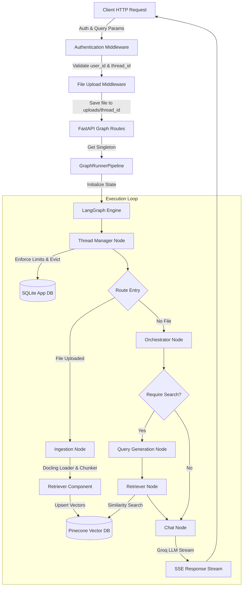

# QRI — Multi-Threaded Stateful RAG Architecture

An industrial-grade, stateful Multi-Tenant RAG (Retrieval-Augmented Generation) backend built with **FastAPI**, **LangGraph**, **Pinecone**, **SQLite**, and **Groq LLM**.

---

## LangGraph Workflow Visualization

The core agentic workflow is orchestrated via **LangGraph**, enabling dynamic query classification, vector database retrieval, token-bounded conversation summarization, math expression solving, and persistent long-term memory extraction.



---

## Architectural Layer Graph

This codebase follows strict Clean Layered Architecture and Dependency Injection (DI) principles:

1. **Central Dependency Injection Hub (`src/core/dependencies.py`)**:
   - Infrastructure singletons (`AppConfig`, `ChatGroq`, `HuggingFaceEmbeddings`, `Pinecone`, `MemorySaver`, `ThreadManager`, `Retriever`) are managed via `@lru_cache` factories.
   - All modules import singletons exclusively through `src.core.dependencies`, enforcing strict decoupling and single-responsibility principles.

2. **Boot-Time Server Warmup (`warmup_dependencies()`)**:
   - During FastAPI startup (`lifespan`), `warmup_dependencies()` pre-loads heavy singletons (HuggingFace weights, Pinecone client, LLM connection pool, and SQLite database) before accepting HTTP traffic.

3. **Multi-Tenant State & Thread Eviction**:
   - User sessions are isolated via `thread_id` namespaces in Pinecone and `MemorySaver` checkpointer memory.
   - SQLite enforces user-thread mapping and thread limits (`MAX_THREADS_PER_USER`). When exceeded, the oldest thread graph state and vector namespace are automatically purged asynchronously.

4. **Optimized LLM System Prompts (`src/prompts/templates.py`)**:
   - High-precision intent classification (`ORCHESTRATOR_PROMPT`).
   - Coreference resolution and multi-query vector expansion (`QUERY_GENERATION_PROMPT`).
   - Token-bounded lossless history compression (`SUMMARIZER_PROMPT`).
   - Grounded RAG synthesis with durable user memory extraction (`CHAT_PROMPT`).

```
┌─────────────────────────────────────────────────────────────────────────────────┐
│  LAYER 7 — API & Presentation (`api/`)                                          │
│                                                                                 │
│   api/main.py                   FastAPI lifespan warmup & router setup          │
│   api/routes/graph_routes.py  /chat, /ingest, /delete HTTP handlers               │
│   api/middlewares/            Auth validator & multi-part file handler          │
│   api/models/chat_model.py    ChatRequest Pydantic schema                       │
└────────────────────────────────────────┬────────────────────────────────────────┘
                                         │
┌────────────────────────────────────────▼────────────────────────────────────────┐
│  LAYER 5 — Service & Pipeline (`src/pipelines/`)                                │
│                                                                                 │
│   get_pipeline()                @lru_cache factory for GraphRunnerPipeline      │
│   graph_runner_pipeline.py      Execution stream orchestrator (astream_events)  │
└────────────────────────────────────────┬────────────────────────────────────────┘
                                         │
┌────────────────────────────────────────▼────────────────────────────────────────┐
│  LAYER 4 — Workflow Graph & Nodes (`src/graphs/`, `src/nodes/`, `src/prompts/`) │
│                                                                                 │
│   src/graphs/builder.py         StateGraph compiler & checkpointer attachment   │
│   src/nodes/main_nodes.py       ingestion, orchestrator, query_gen, retriever   │
│   src/nodes/advance_nodes.py    thread_manager, summarizer, async cleanup       │
│   src/nodes/conditional_nodes.py Pure state routing functions                     │
│   src/prompts/templates.py      Optimized LLM system prompt templates           │
└────────────────────────────────────────┬────────────────────────────────────────┘
                                         │
┌────────────────────────────────────────▼────────────────────────────────────────┐
│  LAYER 3 — Domain Components (`src/services/`, `src/retrievers/`, `src/llm/`)  │
│                                                                                 │
│   src/llm/llm_loader.py              ChatGroq factory                           │
│   src/core/memory.py                 MemorySaver & BaseStore managers           │
│   src/retrievers/pinecone_retriever  Pinecone vector CRUD operations             │
│   src/services/data_ingestion_service DoclingLoader → chunker → vector store    │
└────────────────────────────────────────┬────────────────────────────────────────┘
                                         │
┌────────────────────────────────────────▼────────────────────────────────────────┐
│  LAYER 2 — Core DI Hub (`src/core/dependencies.py`) ★ Singletons Hub ★          │
│                                                                                 │
│   warmup_dependencies()      Pre-loads singletons at FastAPI boot               │
│   get_app_config()           AppConfig settings                                 │
│   get_llm()                  ChatGroq instance                                  │
│   get_embeddings()           HuggingFaceEmbeddings instance                     │
│   get_pinecone_client()      Pinecone client instance                           │
│   get_checkpointer()         MemorySaver checkpoint instance                    │
│   get_thread_manager()       SQLite ThreadManager instance                      │
│   get_retriever()            Retriever instance factory                         │
└──────────────────┬─────────────────────────────────────┬────────────────────────┘
                   │                                     │
┌──────────────────▼──────────┐       ┌──────────────────▼────────────────────────┐
│  LAYER 6 — Database (`db/`) │       │  LAYER 1 — Entities & State Schemas       │
│                             │       │            (`src/domain/`)                │
│  thread_manager.py          │       │                                           │
│  SQLite CRUD for threads.   │       │  domain/config_entities RetrieverConfig   │
│  Purges checkpointer state  │       │  domain/artifacts DataIngestionArtifact   │
│  on eviction or deletion.   │       │  domain/state LangGraph State & Output    │
└─────────────────────────────┘       └───────────────────────────────────────────┘
                   │
┌──────────────────▼──────────────────────────────────────────────────────────────┐
│  LAYER 0 — Core Utilities (`src/core/constants.py`, `src/core/logger.py`)        │
│                                                                                 │
│  core/constants.py    System config constants & defaults                        │
│  core/logger.py       Rotating file logger ('app')                              │
│  core/exceptions.py   Trace-enhanced MyException error wrapper                  │
└─────────────────────────────────────────────────────────────────────────────────┘
```

---

## Detailed System Sequence & Data Flow Graph

### End-to-End Chat & Ingestion Request Flow



---

## Directory Layout

```
.
├── main.py                               Uvicorn web server entry point
├── Dockerfile                            Docker deployment configuration
├── graph_visualization.png               LangGraph execution visualizer
│
├── api/
│   ├── main.py                           FastAPI application boot & lifespan warmup
│   ├── routes/
│   │   └── graph_routes.py               HTTP routes: /ingest, /chat, /delete
│   ├── middlewares/
│   │   ├── authentication_middleware.py  User & thread ID parameter authentication
│   │   └── multi_middleware.py           Multipart form upload processor
│   └── models/
│       └── chat_model.py                 ChatRequest Pydantic payload model
│
├── db/
│   ├── __init__.py                       Re-exports ThreadManager
│   └── thread_manager.py                 SQLite thread persistence & eviction logic
│
├── src/
│   ├── core/
│   │   ├── constants.py                  System constants and threshold defaults
│   │   ├── logger.py                     Rotating file logging configuration
│   │   ├── exceptions.py                 Custom exception trace decorator
│   │   ├── memory.py                     MemorySaver & BaseStore memory providers
│   │   └── dependencies.py              ★ DI Hub: Singleton registry & boot warmup
│   │
│   ├── domain/
│   │   ├── config_entities.py           RetrieverConfig & DataIngestionConfig
│   │   ├── artifacts.py                 DataIngestionArtifact wrapper
│   │   ├── enums.py                     Pipeline abstractions
│   │   └── state.py                     LangGraph State & structured LLM output schemas
│   │
│   ├── llm/
│   │   └── llm_loader.py                 ChatGroq singleton factory
│   │
│   ├── retrievers/
│   │   ├── pinecone_client.py            Pinecone client singleton
│   │   └── pinecone_retriever.py         Pinecone vector store CRUD manager
│   │
│   ├── services/
│   │   ├── conversation_service.py       Conversation history management
│   │   └── data_ingestion_service.py     Document processing pipeline
│   │
│   ├── prompts/
│   │   └── templates.py                  ★ Optimized LLM prompt templates
│   │
│   ├── tools/
│   │   └── solver_tool.py                Numexpr mathematical expression solver tool
│   │
│   ├── nodes/
│   │   ├── conditional_nodes.py          Pure conditional routing logic
│   │   ├── main_nodes.py                 Ingestion, orchestrator, retriever, chat nodes
│   │   └── advance_nodes.py              Thread manager, summarizer & cleanup nodes
│   │
│   ├── graphs/
│   │   └── builder.py                    StateGraph construction & compilation
│   │
│   └── pipelines/
│       └── graph_runner_pipeline.py      Graph execution pipeline wrapper
│
└── data/
    └── app.db                            SQLite database storage
```

---

## API Documentation

### 1. File & Data Ingestion
- **URL**: `POST /api/v1/ingest?user_id={user_id}&thread_id={thread_id}`
- **Headers**: `Content-Type: multipart/form-data`
- **Body**: `file` (Binary File Upload)
- **Response**: `{"success": true, "message": "Data ingested successfully"}`

### 2. Conversational Chat (SSE Stream)
- **URL**: `POST /api/v1/chat?user_id={user_id}&thread_id={thread_id}`
- **Headers**: `Content-Type: application/json`
- **Body**: `{"message": "Summarize the uploaded document"}`
- **Response**: Server-Sent Events stream (`text/event-stream`)

### 3. Delete Thread & Clear Storage
- **URL**: `DELETE /api/v1/delete?user_id={user_id}&thread_id={thread_id}`
- **Response**: `{"success": true, "message": "Thread deleted successfully"}`

---

## Running Locally

1. **Install Dependencies**:
   ```bash
   uv sync
   ```

2. **Configure Environment (`.env`)**:
   ```env
   PINECONE_API_KEY=your_pinecone_key
   GROQ_API_KEY=your_groq_key
   ```

3. **Start the FastAPI Backend**:
   ```bash
   uv run main.py
   ```
